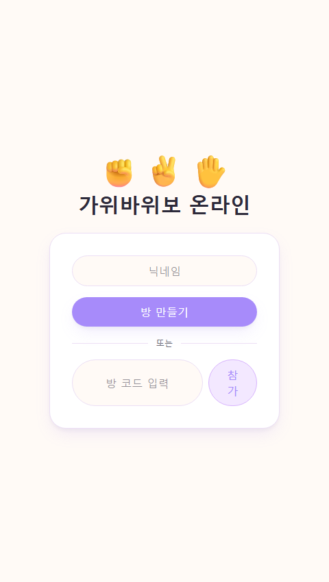
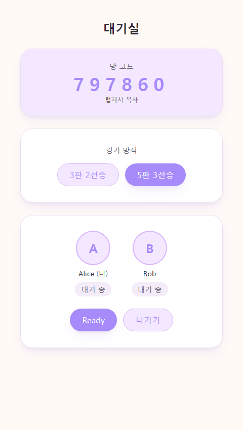
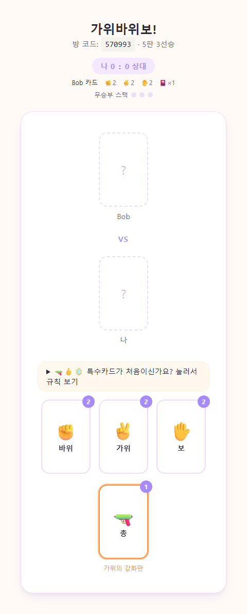
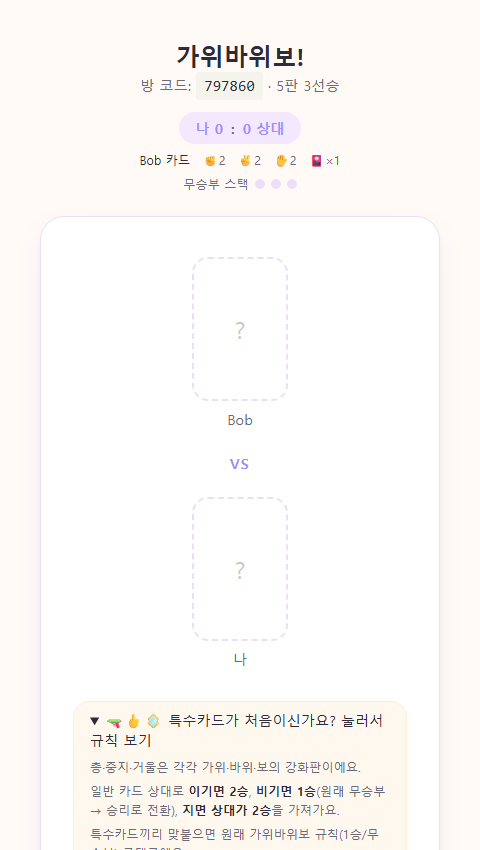
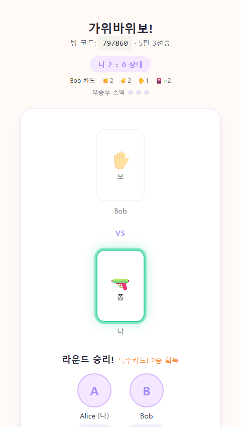

# JoinMyGame

가위바위보 멀티플레이 웹 게임. 단, 게임 구현 자체보다 **Docker 기반 개발 환경 구축**과 **Claude Code를 활용한 개발 워크플로우 학습**이 핵심 목표인 프로젝트입니다. 향후 오목·묵찌빠·카드게임 등 다른 멀티플레이 게임을 추가할 수 있는 기반 플랫폼으로 설계했습니다.

## 스크린샷

| 메인 화면 | 대기실 (경기 방식 선택) |
|---|---|
|  |  |

| 카드 선택 (특수카드 포함) | 특수카드 규칙 안내 |
|---|---|
|  |  |

| 라운드 결과 (특수카드 2승) |
|---|
|  |

## 게임 규칙

### 기본 진행

1. **방 만들기** 또는 **방 참가** (6자리 코드)로 상대와 매칭
2. 대기실에서 **경기 방식**을 선택 (3판 2선승 / **5판 3선승, 기본값**) — 둘 중 아무나 바꿀 수 있고, 바뀌면 양쪽 Ready가 초기화됨
3. 양쪽 모두 **Ready**를 누르면 게임 시작
4. 매 라운드 카드를 하나 선택해서 내면, 양쪽이 다 낸 순간 동시에 카드가 뒤집히며 결과 공개
5. 설정한 승수(2 또는 3)를 먼저 채우면 매치 종료 → **재경기**로 새 매치 시작(점수·카드 전부 초기화) 가능

### 카드와 승패 판정

- 기본카드(가위/바위/보) + 특수카드(총·중지·거울) 총 6종류
- **총 🔫 = 가위**, **중지 🖕 = 바위**, **거울 🪞 = 보** — 각각 대응하는 기본카드의 상위 호환
- 일반 카드를 상대로 특수카드를 냈을 때:
  - 결정승 → **2승**
  - 원래 무승부였을 상황 → **1승** (무승부가 승리로 전환)
  - 결정패 → **상대가 2승**
- 특수카드끼리 맞붙으면 원래 가위바위보 규칙(1승 / 무승부) 그대로 적용

### 카드 자원 관리

- 매치 시작 시 기본카드 각 2장(총 6장) + 무작위 특수카드 1장 지급
- 카드는 **낼 때마다 소모**(무승부 포함, 예외 없음). 라운드 승리는 보상 없음, **패배 시에만** 무작위 특수카드 1장 획득
- 무승부가 **누적 3회**(연속일 필요 없음) 쌓이면 양쪽 카드가 매치 시작 상태로 전부 초기화(점수는 유지) — 화면에 무승부 스택이 항상 표시됨
- 상대방의 기본카드 소모 현황은 정확한 수량 그대로 보이고, 특수카드는 종류를 숨긴 채 총 보유 개수만 공개 — 상대가 뭘 이미 썼는지 보고 전략을 짤 수 있음

## 프로젝트 구조

```
JoinMyGame/
├── CLAUDE.md                  ← 프로젝트 설계/규칙 상세 문서
├── PROGRESS.md                ← 작업 진행 기록
├── docker-compose.yml
├── .env                       ← LAN 테스트용 로컬 오버라이드 (gitignore)
│
├── frontend/
│   ├── Dockerfile
│   └── src/
│       ├── pages/
│       │   ├── MainPage.tsx       ← 방 만들기 / 참가
│       │   ├── RoomPage.tsx       ← 대기실, 경기 방식 선택, Ready
│       │   └── GamePage.tsx       ← 카드 선택, 결과, 재경기
│       ├── components/ui/         ← 게임 공통 UI (Button, Card, Badge, PlayerAvatar)
│       ├── game/rps/
│       │   ├── cards.ts           ← 카드 정의(아이콘/라벨/설명)
│       │   └── components/        ← HandCard(카드 한 장), PlayZone(대결 연출)
│       ├── hooks/useSocket.ts     ← Socket 연결 관리
│       └── types/index.ts         ← 공유 타입
│
└── backend/
    ├── Dockerfile
    └── src/
        ├── server.ts              ← 진입점 (Express + Socket.IO)
        ├── socket/index.ts        ← Socket 이벤트 핸들러
        ├── room/                  ← Room 생성·참가·상태 관리
        └── game/
            ├── index.ts           ← 게임 타입 라우팅, 판정 결과 조합
            └── rps/
                ├── rps.types.ts   ← Hand/특수카드 타입
                ├── rps.cards.ts   ← 카드 지급/소모 로직
                └── rps.game.ts    ← 승패 판정 매트릭스
```

자세한 설계 배경과 Socket 이벤트 명세는 [CLAUDE.md](./CLAUDE.md), 작업 이력은 [PROGRESS.md](./PROGRESS.md)를 참고하세요.

## 실행 방법

```bash
docker compose up --build
```

- Frontend: http://localhost:5173
- Backend: http://localhost:3000 (헬스체크: `/health`)

같은 네트워크의 다른 기기(친구, 모바일 등)와 테스트하려면 루트에 `.env` 파일을 만들어 `VITE_BACKEND_URL`/`CLIENT_ORIGIN`을 이 PC의 LAN IP로 오버라이드하면 됩니다 (`docker-compose.yml` 참고).

## 기술 스택

- Frontend: React, Vite, TypeScript, Tailwind CSS
- Backend: Node.js, Express, Socket.IO, TypeScript
- 개발 환경: Docker, Docker Compose
